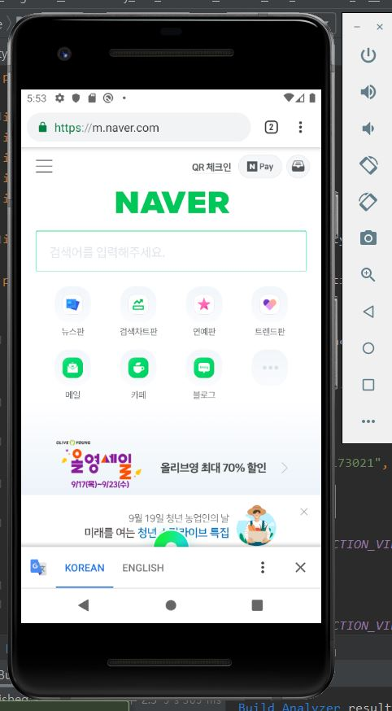
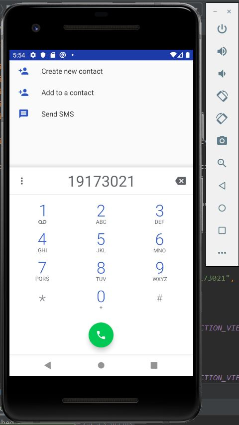
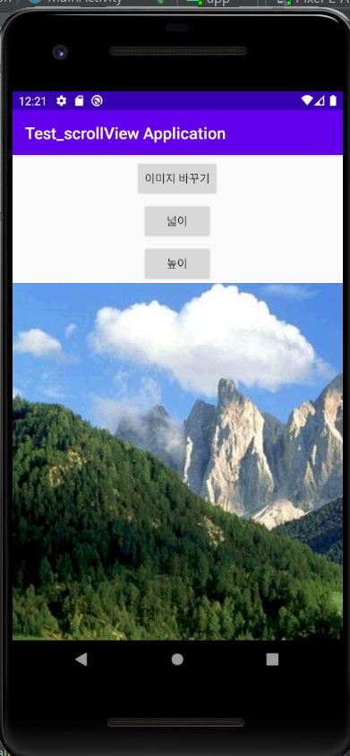
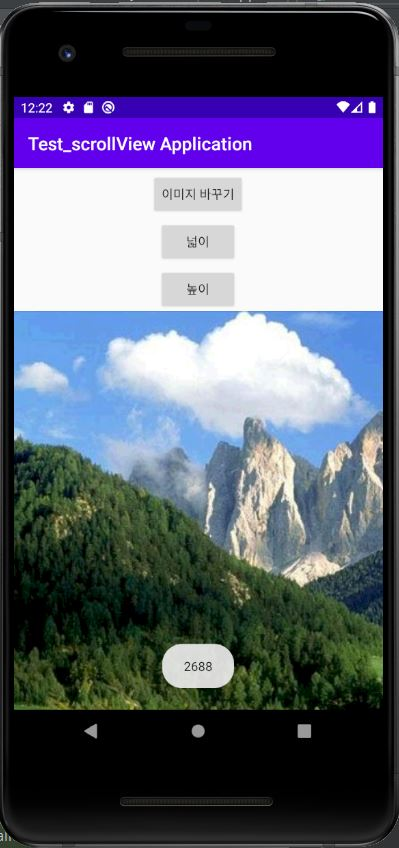
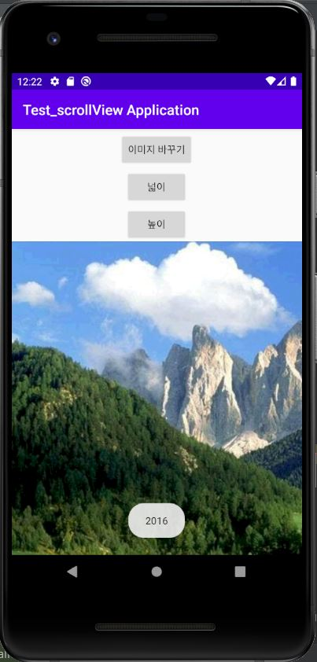
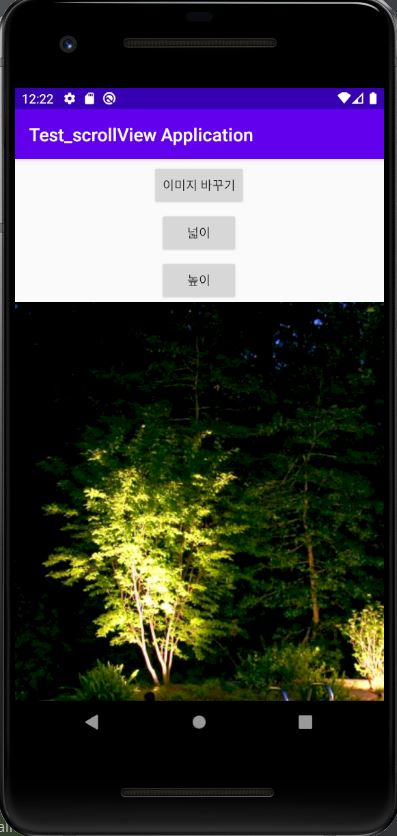

# 19173021 김은비

## 2주차 과제
</img>

## 3주차 과제
</img>
</img>

## 4주차 과제

  - 다이어리/메모 앱  
    글 작성 시 해당 기분에 맞는 감정을 선택할 수 있는데 (기쁨/설렘/행복/보통/우울/슬픔/후회/화남/소소),  
    이 감정은 사용자가 추가/삭제할 수 있다. 감정별로 쓰여진 글들을 따로 확인할 수 있으며, 통계도 만들어지게 된다.  
    작성된 글들은 월별/일별/주별로 볼 수 있고, 오늘 해야할 일과 체크리스트를 작성할 수 있다.
    
## 6주차 과제
</img>
</img>

## 9주차 과제
</img>
</img>
</img>
</img>
